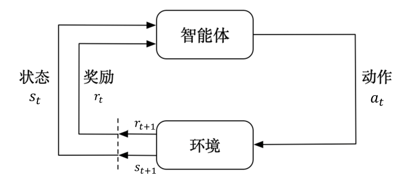

Reinforcement Learning

强化学习（reinforcement learning，RL）讨论的问题是智能体（agent）怎么在复杂、不确定的环 境（environment）里面去最大化它能获得的奖励。如图 1.1 所示，强化学习由两部分组成：智能体和环境。 在强化学习过程中，智能体与环境一直在交互。智能体在环境里面获取某个状态后，它会利用该状态输出 一个动作（action），这个动作也称为决策（decision）。然后这个动作会在环境之中被执行，环境会根据智 能体采取的动作，输出下一个状态以及当前这个动作带来的奖励。智能体的目的就是尽可能多地从环境中 获取奖励。

序列决策（sequential decision making）过程。智能体把它的动作输出给环 境，环境取得这个动作后会进行下一步，把下一步的观测与这个动作带来的奖励返还给智能体。这样的交 互会产生很多观测，智能体的目的是从这些观测之中学到能最大化奖励的策略。

奖励是由环境给的一种标量的反馈信号（scalar feedback signal），这种信号可显示智能体在某一步采 取某个策略的表现如何。强化学习的目的就是最大化智能体可以获得的奖励，智能体在环境里面存在的目 的就是最大化它的期望的累积奖励（expected cumulative reward）。

在一个强化学习环境里面，智能体的目的就是选取一系列的动作来最大化奖励，所以这些选取的动作 必须有长期的影响。但在这个过程里面，智能体的奖励其实是被延迟了的，就是我们现在选取的某一步动 作，可能要等到很久后才知道这一步到底产生了什么样的影响

不同的环境允许不同种类的动作。在给定的环境中，有效动作的集合经常被称为动作空间（action space）。像雅达利游戏和围棋（Go）这样的环境有离散动作空间（discrete action space），在这个动作 空间里，智能体的动作数量是有限的。在其他环境，比如在物理世界中控制一个智能体，在这个环境中就 有连续动作空间（continuous action space）。在连续动作空间中，动作是实值的向量。 例如，走迷宫机器人如果只有往东、往南、往西、往北这 4 种移动方式，则其动作空间为离散动作空 间；如果机器人可以向 360◦ 中的任意角度进行移动，则其动作空间为连续动作空间。

随机性策略（stochastic policy）就是 π 函数。输入一个状态 s，输 出一个概率。这个概率是智能体所有动作的概率，然后对这个概率分布进行采样，可得到智能体将采取的 动作。

确定性策略（deterministic policy）就是智能体直接采取最有可能的动作，即 a ∗ = arg max a π(a | s)

通常情况下，强化学习一般使用随机性策略，随机性策略有很多优点

价值函数的值是对未来奖励的预测，我们用它来评估状态的好坏。价值函数里面有一个折扣因子，我们希望在尽可能短的时间里面得到尽可能多的奖励。

第 3 个组成部分是模型，模型决定了下一步的状态。下一步的状态取决于当前的状态以及当前采取的 动作。它由状态转移概率和奖励函数两个部分组成

根据智能体学习的事物不同，我们可以把智能体进行归类。基于价值的智能体（value-based agent） 显式地学习价值函数，隐式地学习它的策略。策略是其从学到的价值函数里面推算出来的。基于策略的智能体（policy-based agent）直接学习策略，我们给它一个状态，它就会输出对应动作的概率。基于策略的智能体并没有学习价值函数。把基于价值的智能体和基于策略的智能体结合起来就有了演员-评论员智能体（actor-critic agent）。这一类智能体把策略和价值函数都学习了，然后通过两者的交互得到最佳的动作。

EnergyPlus Environment

