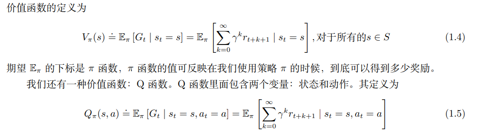
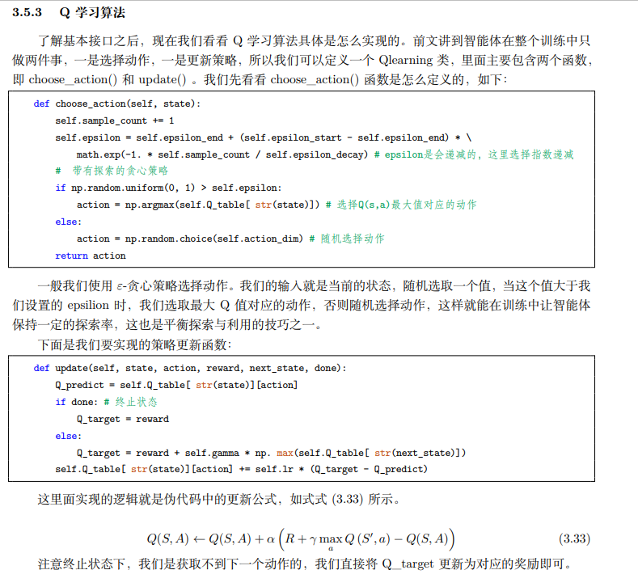

# Reinforcement Learning

强化学习（reinforcement learning，RL）讨论的问题是智能体（agent）怎么在复杂、不确定的环 境（environment）里面去最大化它能获得的奖励。如图 1 所示，强化学习由两部分组成：智能体和环境。 在强化学习过程中，智能体与环境一直在交互。智能体在环境里面获取某个状态后，它会利用该状态输出 一个动作（action），这个动作也称为决策（decision）。然后这个动作会在环境之中被执行，环境会根据智 能体采取的动作，输出下一个状态以及当前这个动作带来的奖励。智能体的目的就是尽可能多地从环境中获取奖励。


序列决策（sequential decision making）过程。智能体把它的动作输出给环 境，环境取得这个动作后会进行下一步，把下一步的观测与这个动作带来的奖励返还给智能体。这样的交 互会产生很多观测，智能体的目的是从这些观测之中学到能最大化奖励的策略。

奖励是由环境给的一种标量的反馈信号（scalar feedback signal），这种信号可显示智能体在某一步采 取某个策略的表现如何。强化学习的目的就是最大化智能体可以获得的奖励，智能体在环境里面存在的目 的就是最大化它的期望的累积奖励（expected cumulative reward）。

在一个强化学习环境里面，智能体的目的就是选取一系列的动作来最大化奖励，所以这些选取的动作 必须有长期的影响。但在这个过程里面，智能体的奖励其实是被延迟了的，就是我们现在选取的某一步动 作，可能要等到很久后才知道这一步到底产生了什么样的影响

不同的环境允许不同种类的动作。在给定的环境中，有效动作的集合经常被称为动作空间（action space）。像雅达利游戏和围棋（Go）这样的环境有离散动作空间（discrete action space），在这个动作 空间里，智能体的动作数量是有限的。在其他环境，比如在物理世界中控制一个智能体，在这个环境中就 有连续动作空间（continuous action space）。在连续动作空间中，动作是实值的向量。 例如，走迷宫机器人如果只有往东、往南、往西、往北这 4 种移动方式，则其动作空间为离散动作空 间；如果机器人可以向 360◦ 中的任意角度进行移动，则其动作空间为连续动作空间。


随机性策略（stochastic policy）就是 π 函数。输入一个状态 s，输 出一个概率。这个概率是智能体所有动作的概率，然后对这个概率分布进行采样，可得到智能体将采取的 动作。

确定性策略（deterministic policy）就是智能体直接采取最有可能的动作，即 a ∗ = arg max a π(a | s)

通常情况下，强化学习一般使用随机性策略，随机性策略有很多优点


价值函数的值是对未来奖励的预测，我们用它来评估状态的好坏。价值函数里面有一个折扣因子，我们希望在尽可能短的时间里面得到尽可能多的奖励。




第 3 个组成部分是模型，模型决定了下一步的状态。下一步的状态取决于当前的状态以及当前采取的 动作。它由状态转移概率和奖励函数两个部分组成


根据智能体学习的事物不同，我们可以把智能体进行归类。基于价值的智能体（value-based agent） 显式地学习价值函数，隐式地学习它的策略。策略是其从学到的价值函数里面推算出来的。基于策略的智能体（policy-based agent）直接学习策略，我们给它一个状态，它就会输出对应动作的概率。基于策略的智能体并没有学习价值函数。把基于价值的智能体和基于策略的智能体结合起来就有了演员-评论员智能体（actor-critic agent）。这一类智能体把策略和价值函数都学习了，然后通过两者的交互得到最佳的动作。


动作空间（action space）、离散动作空间（discrete action space）和连续动作空间（continuous action space）：在给定的环境中，有效动作的集合被称为动作空间，智能体的动作数量有限的动作空间称为离散 动作空间，反之，则被称为连续动作空间。

基于策略的（policy-based）：智能体会制定一套动作策略，即确定在给定状态下需要采取何种动作， 并根据这个策略进行操作。强化学习算法直接对策略进行优化，使制定的策略能够获得最大的奖励。 （根据状态的输入，输出动作的概率，然后选择）

基于价值的（valued-based）：智能体不需要制定显式的策略，它维护一个价值表格或者价值函数，并 通过这个价值表格或价值函数来执行使得价值最大化的动作。(根据状态的输入，输出一个数值)


马尔可夫性质也可以描述为给定当前状态时，将来的状态与过去状态是条件独立的[1]。如果某一个过 程满足马尔可夫性质，那么未来的转移与过去的是独立的，它只取决于现在。马尔可夫性质是所有马尔可 夫过程的基础。

马尔可夫奖励过程（Markov reward process, MRP）是马尔可夫链加上奖励函数。在马尔可夫奖 励过程中，状态转移矩阵和状态都与马尔可夫链一样，只是多了奖励函数（reward function）。


回报（return）可以定义为一个回合内，奖励的逐步叠加。有折扣因子

对于马尔可夫奖励过程，状态价值函数被定义成回报的期望，


那如何计算价值呢


如果我们在马尔可夫链上加上奖励，那么到达每个状态，我们都会获得一个奖励。


Q函数形式的贝尔曼函数


策略评估在 有些地方也被称为（价值）预测 [（value）prediction）]，也就是预测我们当前采取的策略最终会产生多少价值。


预测（评估一个给定的策略）的输入是马尔可夫决策过程 < S, A, P, R, γ > 和策略 π，输出是价值函 数 Vπ。预测是指给定一个马尔可夫决策过程以及一个策略 π ，计算它的价值函数，也就是计算每个状态 的价值。

控制（搜索最佳策略）的输入是马尔可夫决策过程 < S, A, P, R, γ >，输出是最佳价值函数（optimal value function）V ∗ 和最佳策略（optimal policy）π ∗。控制就是我们去寻找一个最佳的策略，然后同时输 出它的最佳价值函数以及最佳策略。


最佳价值函数是指，我们搜索一种策略 π 让每个状态的价值最大。V ∗ 就是到达每一个状态，它的值的最大化情况。在这种最大化情况中，我们得到的策略就是最佳策略。

最佳策略使得每个状态的价值函数都取得最大值。所以如果我们可以得到一个最佳价值函数，就可以认为 某个马尔可夫决策过程的环境可解。

当取得最佳价值函数后，我们可以通过对 Q 函数进行最大化来得到最佳策略


怎样进行策略搜索？

A: 最简单的策略搜索方法就是穷举。假设状态和动作都是有限的，那么每个状态我们可以采取 A 种 动作的策略，总共就是 |A| |S| 个可能的策略。我们可以把策略穷举一遍，算出每种策略的价值函数，对比 一下就可以得到最佳策略。 但是穷举非常没有效率，所以我们要采取其他方法。搜索最佳策略有两种常用的方法：策略迭代和价值迭代。


策略迭代

策略迭代由两个步骤组成：策略评估和策略改进（policy improvement）。

策略评估是当前我们在优化策略 π，在优化过程中得到一个最新的策略。我们先保证这个策略不变， 然后估计它的价值，即给定当前的策略函数来估计状态价值函数。第二个步骤是策略改进，得到状态价值 函数后，我们可以进一步推算出它的 Q 函数。得到 Q 函数后，我们直接对 Q 函数进行最大化，通过在 Q 函数做一个贪心的搜索来进一步改进策略。这两个步骤一直在迭代进行。

策略改进，看我们是如何改进策略的。得到状态价值函数后，我们就 可以通过奖励函数以及状态转移函数来计算 Q 函数。

策略改进：对于每个状态，策略改进会得到它的新一轮的策略，对于每个状态，我们取使它得到最大值的动作。下面就是新的策略。


价值迭代

我们从另一个角度思考问题，动态规划的方法将优化问题分成两个部分。第一步执行的是最优的动作。 之后后继的状态的每一步都按照最优的策略去做，最后的结果就是最优的。

最优性原理定理（principle of optimality theorem）：一个策略 π(a|s) 在状态 s 达到了最优价值， 也就是 Vπ(s) = V ∗ (s) 成立，当且仅当对于任何能够从 s 到达的 s ′，都已经达到了最优价值。也就是对于 所有的 s ′，Vπ(s ′ ) = V ∗ (s ′ ) 恒成立。


免模型强化学习方法没有获取环境的状态转移和奖励函数，而是让智能体与环境进行交互，采集大量的轨迹数据，智能体从轨迹中获取信息来改进策略，从而获得更多的奖励。


蒙特卡洛仿真是指我们可以采样大量的轨迹，计算所有轨迹的真实回报，然后计算平均值。蒙特卡洛 方法使用经验平均回报（empirical mean return）的方法来估计，它不需要马尔可夫决策过程的状态转移 函数和奖励函数，并且不需要像动态规划那样用自举的方法。此外，蒙特卡洛方法有一定的局限性，它只 能用在有终止的马尔可夫决策过程中。


也可以写成增量的模式


时序差分


Q表格的两个坐标就是状态和动作，里面的值就是对应状态下选择某个动作获得的Q值，也就是回报。结合Q函数的增量形式，贝尔曼形式理解。





策略梯度

策略一般记作 π。假设我们使用深度学习来做强化学习，策略就是一个网络。网络里面有一些参数， 我们用 θ 来代表 π 的参数。输入一个东西后，网络会给每一个可以采取 的动作一个分数。我们可以把这个分数当作概率，演员根据概率的分布来决定它要采取的动作。输出层的个数就是动作的个数，然后根据概率选择。


更新完模型以后，我们要重新采样数据再更新模型。注意，一般策略梯度（policy gradient，PG） 采样的数据只会用一次。我们采样这些数据，然后用这些数据更新参数，再丢掉这些数据。接着重新采样 数据，才能去更新参数


PPO

一旦更新了参数，从 θ 变成 θ ′ ，概 率 pθ(τ ) 就不对了，之前采样的数据也不能用了。所以策略梯度是一个会花很多时间来采样数据的算法， 其大多数时间都在采样数据。智能体与环境交互以后，接下来就要更新参数。我们只能更新参数一次，然 后就要重新采样数据，才能再次更新参数。这显然是非常花时间的，所以我们想要从同策略变成异策略， 这样就可以用另外一个策略 πθ ′、另外一个演员 θ ′ 与环境交互（θ ′ 被固定了），用 θ ′ 采样到的数据去训练 θ。假设我们可以用 θ ′ 采样到的数据去训练 θ，我们可以多次使用 θ ′ 采样到的数据，可以多次执行梯度上 升（gradient ascent），可以多次更新参数，都只需要用同一批数据。因为假设 θ 有能力学习另外一个演员 θ ′ 所采样的数据，所以 θ ′ 只需采样一次，并采样多一点的数据，让 θ 去更新很多次，这样就会比较有效 率。


Q：我们能不能让整个训练过程变得稳定，能不能直接估测随机变量 G 的期望值？

A：我们直接用一个网络去估测在状态 s 采取动作 a 时 G 的期望值。如果这样是可行的，那么在随 后的训练中我们就用期望值代替采样的值，这样就会让训练变得更加稳定。

Q：怎么使用期望值代替采样的值呢？ A：这里就需要引入基于价值的（value-based）的方法。基于价值的方法就是深度 Q 网络。深度 Q 网 络有两种函数，有两种评论员。如图 9.2 所示，第一种评论员是 Vπ(s)。即假设演员的策略是 π，使用 π 与 环境交互，当智能体看到状态 s 时，接下来累积奖励的期望值是多少。第二种评论员是 Qπ(s, a)。Qπ(s, a) 把 s 与 a 当作输入，它表示在状态 s 采取动作 a，接下来用策略 π 与环境交互，累积奖励的期望值是多 少。Vπ 接收输入 s，输出一个标量。Qπ 接收输入 s，它会给每一个 a 都分配一个 Q 值


 


优势演员-评论员算法的流程如图 9.4 所示，我们有一个 π，有个初始的演员与环境交互，先收集资 料。在策略梯度方法里收集资料以后，就来更新策略。但是在演员-评论员算法里面，我们不是直接使用那 些资料来更新策略。我们先用这些资料去估计价值函数，可以用时序差分方法或蒙特卡洛方法来估计价值 函数。接下来，我们再基于价值函数，使用式 (9.6) 更新 π

有了新的 π 以后，再与环境交互，收集新的资料，去估计价值函数。再用新的价值函数更新策略，更新演 员。整个优势演员-评论员算法就是这么运作的。

实现优势演员-评论员算法的时候，有两个一定会用到的技巧。第一个技巧是，我们需要估计两个网 络：V 网络和策略的网络（也就是演员）。评论员网络 Vπ(s) 接收一个状态，输出一个标量。演员的策略 π(s) 接收一个状态，如果动作是离散的，输出就是一个动作的分布，如果动作是连续的，输出就是一个连 续的向量


异步优势演员-评论员算法的运作流程，如图 9.7 所示，异步优势演员-评论员算法一开始有一个全局 网络（global network）。全局网络包含策略网络和价值网络，这两个网络是绑定（tie）在一起的，它们的 前几个层会被绑在一起。假设全局网络的参数是 θ1，我们使用多个进程，每个进程用一张 CPU 去跑。比 如我们有 8 个进程，则至少 8 张 CPU。每一个进程在工作前都会把全局网络的参数复制过来。接下来演 员就与环境交互，每一个演员与环境交互的时候，都要收集到比较多样的数据

计算出梯度以后，要用梯度去更新参数。我们就计算一下梯度，用梯度去更 新全局网络的参数。就是这个进程算出梯度以后，就把梯度传回给中央的控制中心，中央的控制中心就会 用这个梯度去更新原来的参数


# EnergyPlus Environment

下载地址：https://energyplus.net/

简介：

EnergyPlus™ is a whole building energy simulation program that engineers, architects, and researchers use to model both energy consumption—for heating, cooling, ventilation, lighting and plug and process loads—and water use in buildings。

EnergyPlus is a console-based program that reads input and writes output to text files. It ships with a number of utilities including IDF-Editor for creating input files using a simple spreadsheet-like interface, EP-Launch for managing input and output files and performing batch simulations, and EP-Compare for graphically comparing the results of two or more simulations。

简单使用：

use cmd。

可以在example file里面选择idf文件和epw文件


EnergyPlus can be run by specifying a number of options followed by the path to the input file. The file itself is usually in IDF (Input Data File) format or epJSON format, but it may also be in IMF (Input Macro File) format to be run with EPMacro using the --epmacro option. Each option has a short form (a single-character preceded by a single dash, e.g., "-h") and a long form (a more descriptive string of characters preceded by double dashes, e.g., "--help"). Several of these options are commonly used including the weather, output-prefix, expandobjects, and readvars options。

EP-Launch


IDF

The legacy file format is a text-based format that describes each input object in series. Each input object starts with the type of input object, and each value for each field follows in strict order separated by commas. The end of the input object is indicated by a semi-colon. Comments are indicated by an exclamation point “!” and anything after this is ignored by EnergyPlus. Commonly, an input object is spread over many lines in the file with one value for each field per line. The names of each field are not required but are usually shown after the value and the comma or semicolon as a special comment using “!-” as an indicator. The input objects can be in any order.

里面很多idf的内容特别复杂

一般全流程都是openstudio sketchup+插件 ep 联合使用模拟，前面是idf的建模，后面是模拟。

如何使用python或者c++进行控制，因为要使用强化学习

第一种使用eppy库，每次运行都不断修改idf文件，修改其中重要的参数和结构。然后使用eppy中的run方法运行。获得一些文件输出，然后解析文件，获得重要数据。但是这样比较麻烦，因为idf文件内容多，专业性强，难处理。

然后可以使用ep官方的库，只要下载了ep，ep里面的文件夹里面就会有。

https://nrel.github.io/EnergyPlus/api/python/

主要是通过注册回调函数，在ep执行的过程中，插入我们需要执行的操作即可。


# 如何运行

下载energyplus

修改src/EnergyPlus.py中的路径

```python
sys.path.insert(0,r"C:\EnergyPlusV23-1-0")
```

根据自己情况选择下列文件

```py
idf_file = "./resource/HVACTemplate-5ZoneVAVFanPowered.idf"
epw_file = "./resource/USA_CO_Golden-NREL.724666_TMY3.epw"
idd_file = r"C:\EnergyPlusV23-1-0\Energy+.idd"
```

在code目录下打开文件，否则可能因为工作区的问题运行不了

可以直接执行的py文件如下

```bash
src/Fix_Point.py
src/multi_agent.py
src/RuleBased.py
src/single_a2c.py
src/test.py
```

pth都是一些训练的模型
